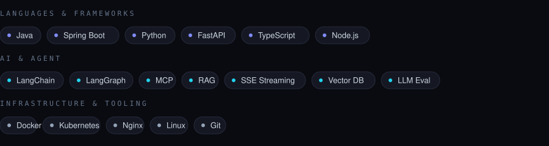
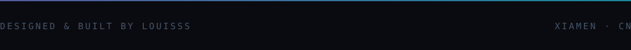

 

---

### About

**Java / Python 双栈后端工程师，主攻 AI Agent 工程化落地。**

我关注的不只是「能不能跑通一个 Agent demo」，而是**能不能把它做成可维护、可观测、可灰度的线上系统**：
多 Agent 路由怎么拆、上下文怎么治理、流式输出怎么穿过多层网关、效果变化怎么量化回归。

<table>
<tr>
<td width="33%" valign="top">
<b>◼ 现在在做</b>  
<code>contrib-radar</code> —— 全自动开源贡献 Agent：发现候选仓库 → 健康度体检 → Issue 打分 → 碰撞检测 → 提交 PR
</td>
<td width="33%" valign="top">
<b>◼ 深耕方向</b>  
Multi-Agent Orchestration · Context Engineering · RAG · Streaming 架构 · LLM 评估
</td>
<td width="33%" valign="top">
<b>◼ 求职方向</b>  
AI Agent / LLM 应用方向的后端与 Agent 工程岗位
</td>
</tr>
</table>

---

### Stack

---

### Open Source

<table>
<tr>
<td width="50%" valign="top">

**🛰 contrib-radar** · `Python` · `Agent Skill`

开源贡献雷达。用可解释的打分与碰撞检测，在写代码之前锁定真正值得投入的贡献机会。

- 候选仓库发现 + 12 项健康度体检
- Issue 双维度打分（可认领度 × 技术栈匹配）
- **分页全量 PR 碰撞检测**，避免返工撞车
- 零依赖 Python 脚本，遵循 Agent Skills 标准

[→ louisss1016/contrib-radar](https://github.com/louisss1016/contrib-radar)

</td>
<td width="50%" valign="top">

**🧭 vibecoding-navigator** · `Shell` · `Workflow`

Vibe Coding 全流程导航 Skill：需求澄清 → 最小切片推进 → 子 Agent 执行与验收 → 五维评测 → 上线运维。

- 把「随手 vibe」收敛成可复现的工程流程
- 切片推进 + 验收门禁，避免一次性生成失控
- 五维评测量化产出质量

[→ louisss1016/vibecoding-navigator](https://github.com/louisss1016/vibecoding-navigator)

</td>
</tr>
</table>

**在飞的社区贡献**

| 项目 | PR / Issue | 内容 | 状态 |
| :--- | :--- | :--- | :--- |
| pydantic/pydantic-ai | [#8855](https://github.com/pydantic/pydantic-ai/pull/8855) | 补全 Image Generation 文档「如何取回生成的图片」 | 待 Review |
| modelscope/ms-agent | [#1008](https://github.com/modelscope/ms-agent/pull/1008) | 补齐英文 Quick Start 缺失的 Using WebUI 章节 | 待 Review |
| pydantic/pydantic-ai | [#8861](https://github.com/pydantic/pydantic-ai/issues/8861) | 定位 `docs-only checks` 全量误报的根因与文件清单 | 已提交分析 |

---

### Engineering

<b>WMS 智能助手</b> —— 仓库场景下的多 Agent 系统（代表项目）

 

把大模型能力接进仓储业务系统，做成一个**能真正被一线使用**的智能助手，而不是聊天玩具。

- **多 Agent 路由** —— 按意图分发到不同 Agent，避免单 Agent prompt 无限膨胀
- **LangGraph 编排** —— 用状态图管理多轮对话与工具调用，显式建模分支与回退
- **MCP 工具接入** —— 把仓储域能力封装为标准工具协议，解耦模型与业务接口
- **FastAPI + StreamingResponse（SSE）** —— 端到端流式输出，降低首字延迟
- **RAG** —— 业务知识库检索增强，抑制领域幻觉
- **MoE 评估** —— 多维度评估体系，让效果变化可量化、可回归

`Spring Boot` · `LangChain` · `LangGraph` · `MCP` · `FastAPI (SSE)` · `RAG`

<b>企业级后端项目经历</b>

 

- **格力网批** —— 网批业务后端系统，`Java` / `Spring Boot` 技术栈
- **小米客服大模型** —— 大模型驱动的客服系统，对话能力与业务系统对接
- **小米全渠道** —— 全渠道业务后端，多渠道数据与流程整合

---

如果你也在做 Agent 落地、后端架构或开源协作，欢迎开个 Issue 一起聊聊。

